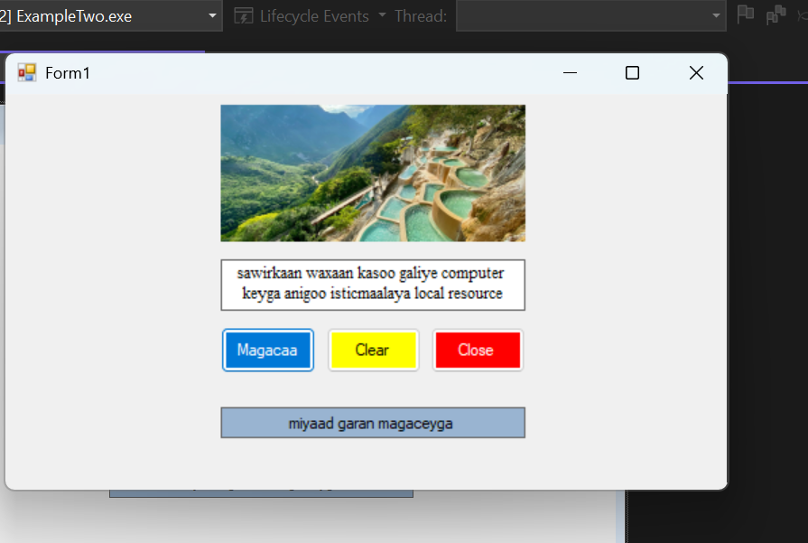

---

screenshot kaan waxaan ku practice gareeye, sida label looga badalo text ayadoo la isticmaalaayo 
buttons sidoo kale waxaan ku practice gareeye sida loo soo galiye sawir aydoo laga soo galinaayo 
pictureBox.

# properties ka aan isticmaalay waxaa ka mid ah :

1. borderStyle
2. textAlignment
3. autoSize
4. backColor and foreColor
5. name 
6. font

# Controls ka aan isticmaalay waxaa ka mid ah :

1. Button 
2. Label
3. TextBox
4.PictureBox